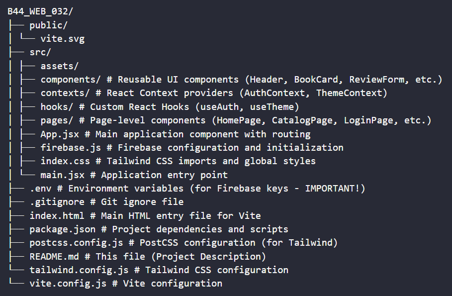

# Library Management System - Frontend

## Introduction

This project is a functional and elegant frontend application for a Library Management System. Built with React, Vite, and Firebase Realtime Database, it allows users to browse books, manage their borrowed items, authenticate securely, and interact through reviews and ratings. The UI is styled using Tailwind CSS, featuring a clean aesthetic and a dark mode option.

## Features

- **User Authentication:** Secure Sign Up, Login, and Logout using Firebase Authentication.
- **Book Catalog:** Browse and search available books.
- **Book Details:** View detailed information about a specific book.
- **Borrow & Return:** Logged-in users can borrow available books and return their borrowed items. Due dates are automatically calculated.
- **User Profiles:** View basic profile information and a list of currently borrowed books with due dates.
- **Reviews & Ratings:** Users can submit ratings and text reviews for books. Average ratings and recent reviews are displayed.
- **Dark Mode:** Toggle between Light, Dark, and System default themes.
- **Responsive Design:** User interface adapts to different screen sizes using Tailwind CSS.
- **Social Sharing:** Share favorite books on social media platforms.

## Directory Structure



## Tech Stack

- **Frontend:** React.js (v19), Vite
- **Routing:** React Router DOM (v7.5.2)
- **Styling:** Tailwind CSS (v3.3.5)
- **State Management:** React Context API, React Hooks (`useState`, `useEffect`, `useContext`)
- **Backend:** Firebase (Authentication, Realtime Database)
- **Date Management:** `date-fns`

## APIs Used

- **Firebase Authentication:** For user sign-up, login, logout, and managing user sessions.
- **Firebase Realtime Database:** For storing and retrieving application data (books, user profiles, reviews) in a NoSQL JSON format.

## API Endpoints (Firebase RTDB Paths)

Data is accessed via the Firebase SDK using references to specific paths:

- `/books`: Collection of all book objects.
  - `/books/{bookId}`: Specific book details.
- `/users`: Collection of user profile data.
  - `/users/{userId}`: Specific user's profile (name, email, borrowed books).
  - `/users/{userId}/borrowedBooks/{bookId}`: Reference indicating a user has borrowed a book.
- `/reviews`: Collection storing reviews grouped by book.
  - `/reviews/{bookId}`: Collection of reviews for a specific book.
  - `/reviews/{bookId}/{reviewId}`: A specific review object (userId, userName, rating, text, timestamp).

## Installation Guide

1.  **Clone the Repository:**

    ```bash
    git clone https://github.com/saideep-priyadarshan/B44_WEB_032.git
    cd B44_WEB_032
    ```

2.  **Install Dependencies:**

    ```bash
    npm install
    ```

3.  **Firebase Setup:**

    - Create a Firebase project at [console.firebase.google.com](https://console.firebase.google.com/).
    - Add a Web App to your project.
    - Enable **Authentication** (Email/Password method).
    - Enable **Realtime Database** (start in Test Mode for development, secure later).
    - Copy your Firebase project configuration credentials.

4.  **Environment Variables:**

    - Create a file named `.env` in the project root.
    - Add your Firebase configuration keys:
      ```dotenv
      VITE_FIREBASE_API_KEY=YOUR_API_KEY
      VITE_FIREBASE_AUTH_DOMAIN=YOUR_AUTH_DOMAIN
      VITE_FIREBASE_DATABASE_URL=YOUR_DATABASE_URL
      VITE_FIREBASE_PROJECT_ID=YOUR_PROJECT_ID
      VITE_FIREBASE_STORAGE_BUCKET=YOUR_STORAGE_BUCKET
      VITE_FIREBASE_MESSAGING_SENDER_ID=YOUR_MESSAGING_SENDER_ID
      VITE_FIREBASE_APP_ID=YOUR_APP_ID
      ```
    - **Important:** Ensure `.env` is listed in your `.gitignore` file to avoid committing sensitive keys.

5.  **Import Sample Data:**
    - Check the sample JSON data included inside the data folder in the root directory as `sample-data.json`.
    - In your Firebase Realtime Database console, use the "Import JSON" option to upload this file.

## Usage

1.  **Start the Development Server:**
    ```bash
    npm run dev
    ```
2.  Open your browser and navigate to the local URL provided by Vite (usually `http://localhost:5173`).
3.  Sign up for a new account or log in if you already have one.
4.  Browse the catalog, view book details, borrow/return books, and leave reviews.
5.  Use the theme toggle in the header to switch between light, dark, and system modes.
